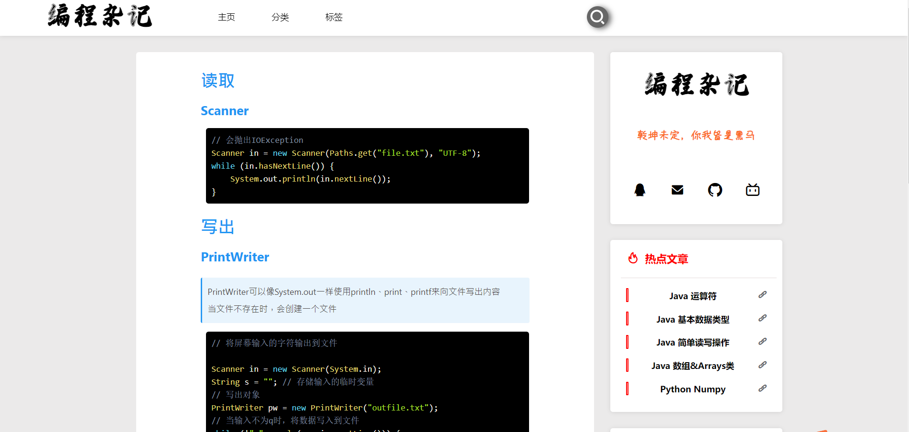
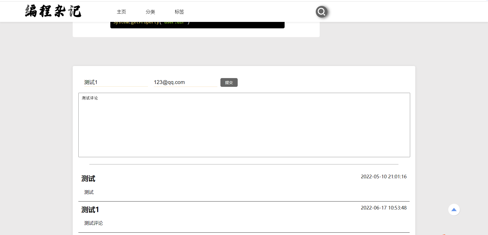
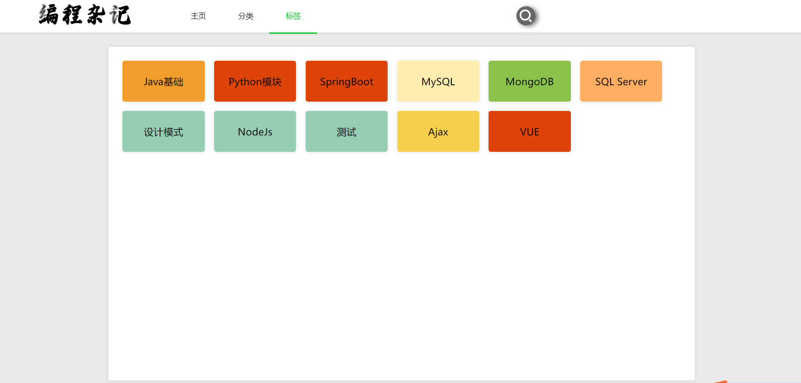
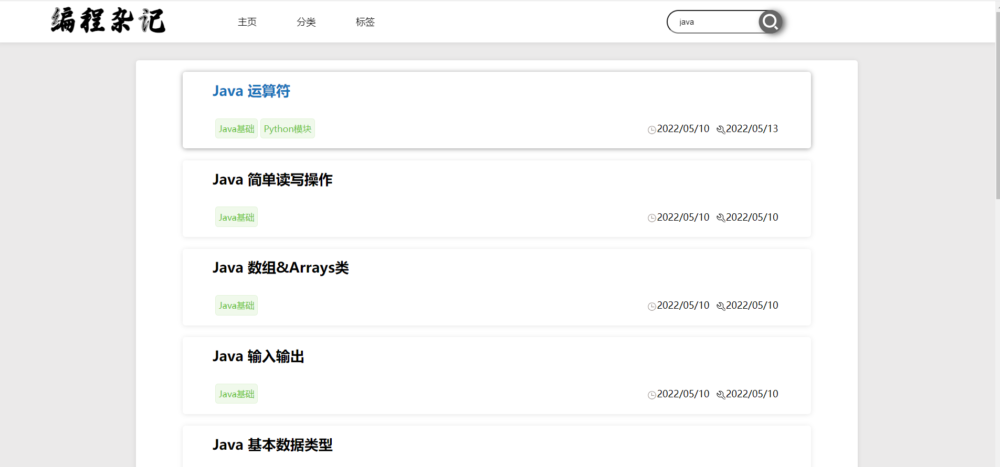
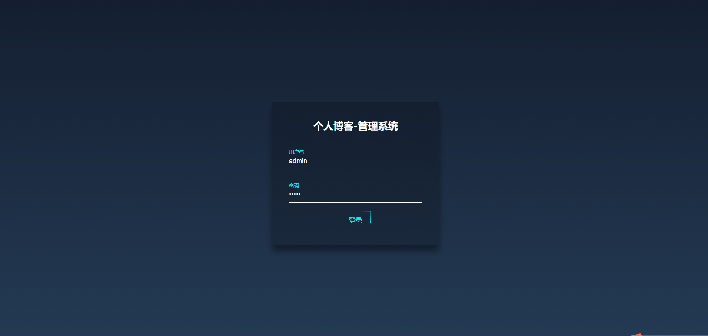
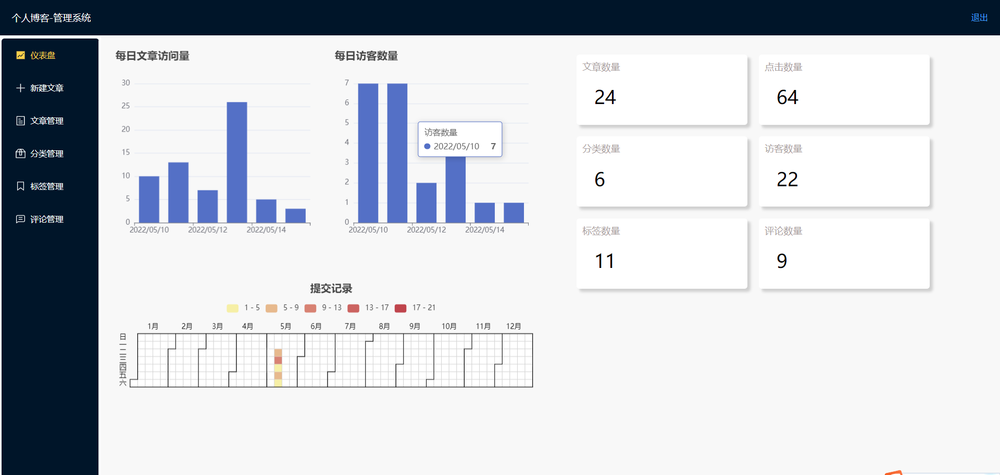
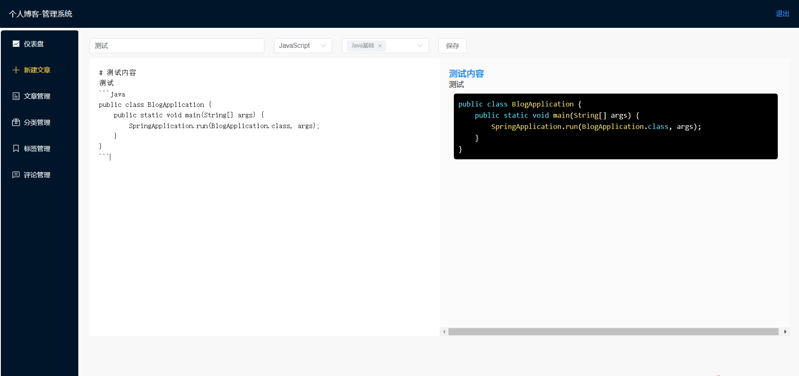
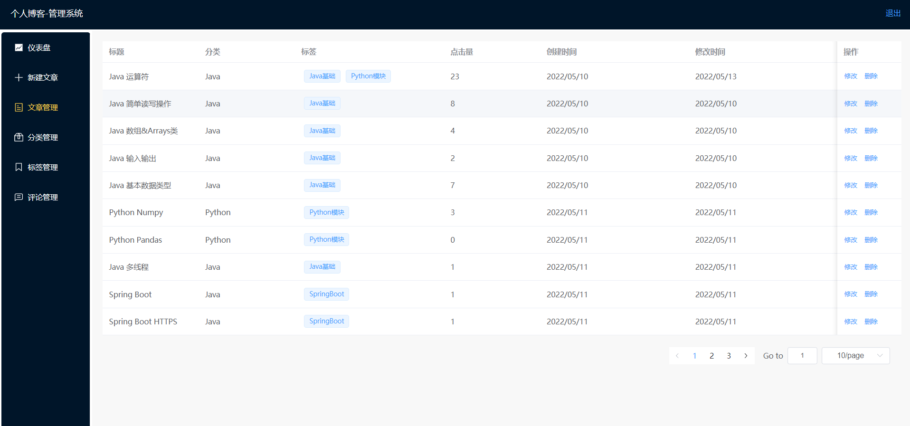
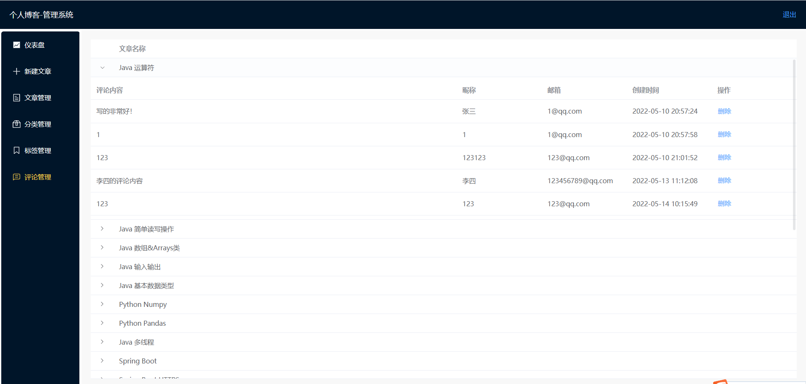

# 个人博客

## 使用技术

- 项目特点
  - 前后端分离

- 后端技术
  - SpringBoot
  - MongoDB
  - JWT
  - FastJson
- 前端技术
  - HTML
  - CSS
  - JS
  - ElementUI
  - VUE

- 实现难点
  - 解决跨域问题
  - 自定义对象转换为JSON的格式
  - 前后端分离鉴权问题
  - MarkDown语法解析

## 界面展示

### 前台界面

### 后台界面

